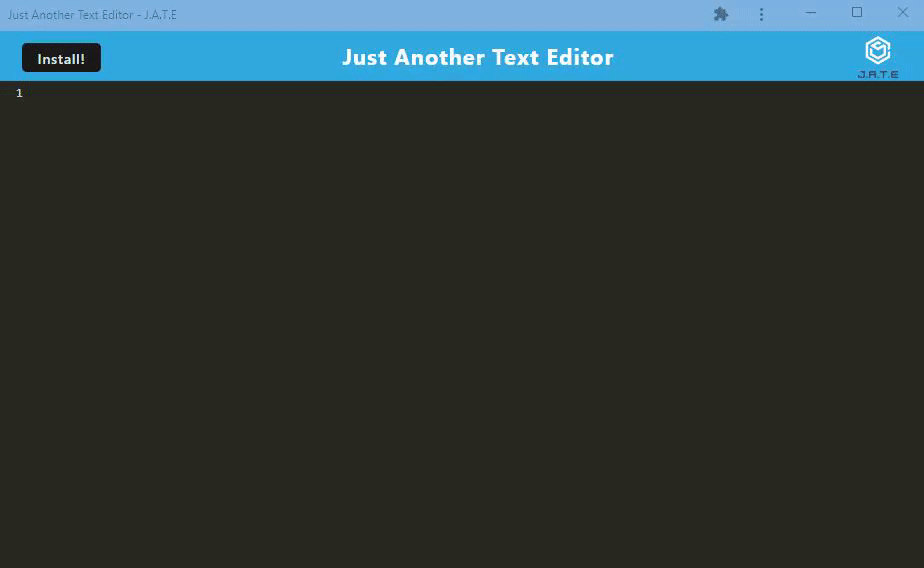

# Just Another Text Editor
      
 ## Table of Contents 

      
-----------------------------------------

      
 - [Description](#description) 

      
 - [Showcase](#link) 

      
 - [Application](#application)  

      
 - [Acknowledgements](#acknowledgements) 

      
 - [Questions?](#email) 

      
 ## Description 

      
-----------------------------------------

      
 A reliable text editor that allows you to do things such as write notes, reminders, code snippets and whatever you can put your mind to in your browser! This application also has an installation feature so you can continue writing notes even when offline. This is, well, Just Another Text Editor.

      
 ## Showcase

      
-----------------------------------------
 
      
 

      
 ## Application 

      
-----------------------------------------
 
      
  Click [Here](https://protected-caverns-31961.herokuapp.com/) for the deplyoed HEROKU app.

      
 
      
 ## Acknowledgements

      
-----------------------------------------
 
      
  Shoutout to the instructional staff in the UCF bootcamp for providing us with starter code!

      
 ## Questions?

      
-----------------------------------------
 
      
  My Github: [Akuruu](https://github.com/Akuruu)

      
  Contact Me: anjalismith0529@gmail.com 
